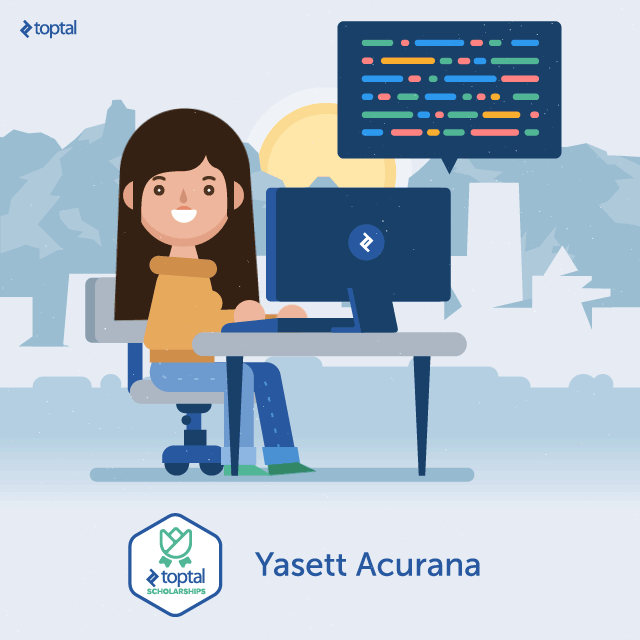

 
### Hi, I'm Begim   

## I'm a Frontend Developer!
<!-- Intemediate level experience in Software Engineer and  
Frontned Mentor, with extensive knowledge, and years  
of experience, working in popular web technologies
 -->
 
### 🤝 Connect with me:

[][linkedin]
[][telegram]
[][instagram]&nbsp;

### 💻 Tech Stack:

&nbsp;
&nbsp;
&nbsp;
&nbsp;
&nbsp;
&nbsp;
&nbsp;
&nbsp;

 

 

<table>
  <tr>
    <td>
      
    </td>
  </tr>
</table>

[telegram]: https://t.me/Begim_bem
[instagram]: https://instagram.com/begim_bem?igshid=YmMyMTA2M2Y=
[linkedin]: https://www.linkedin.com/feed/
